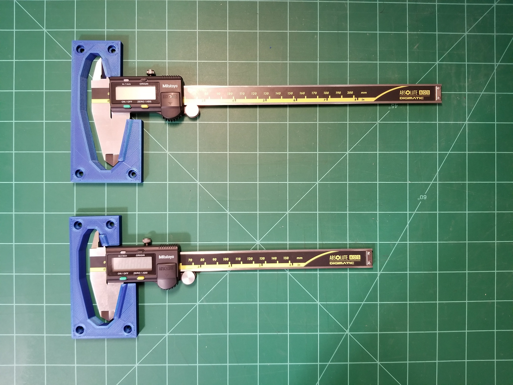
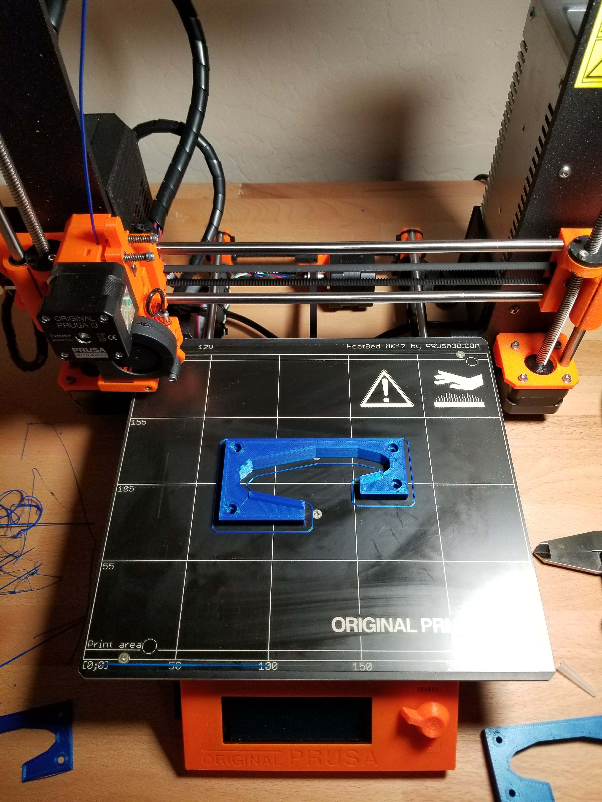

# 3D Printed Mitutoyo Wallmount
A Simple 3D Printed Wallmount holder for Mitutoyo Digital Calipers.  The holders are designed to mount flush up against a wall using 4 screws.  The screw hols are 4mm diameter with a 7mm diameter x 4mm deep countersink hole for the screw head.

Author: Christopher Ross

# Models

## 200mm Version for Models:

* Mitutoyo Digimatic Calipers 500-197-30

## 150mm Version for Models:

* Mitutoyo Digimatic Calipers 500-196-30

# Photos

   

# G-Code Files

Generated G-Code files are for Prusa I3 Mk2

# License
[CREATIVE COMMONS ATTRIBUTION 4.0](https://creativecommons.org/licenses/by/4.0/legalcode)
